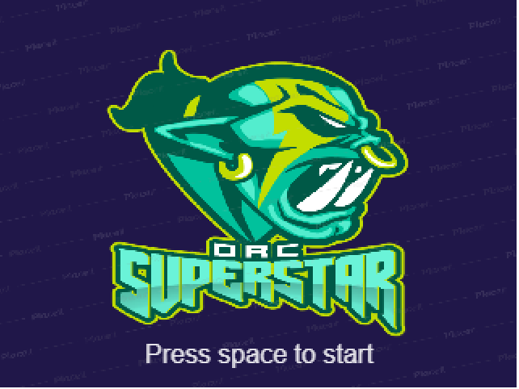
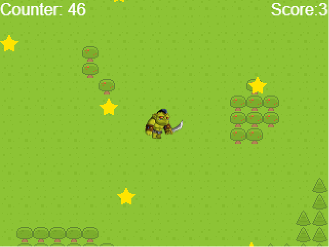

<!--
*** Thanks for checking out this README Template. If you have a suggestion that would
*** make this better, please fork the repo and create a pull request or simply open
*** an issue with the tag "enhancement".
*** Thanks again! Now go create something AMAZING! :D
-->

<!-- PROJECT SHIELDS -->
<!--
*** I'm using markdown "reference style" links for readability.
*** Reference links are enclosed in brackets [ ] instead of parentheses ( ).
*** See the bottom of this document for the declaration of the reference variables
*** for contributors-url, forks-url, etc. This is an optional, concise syntax you may use.
*** https://www.markdownguide.org/basic-syntax/#reference-style-links
-->
[![Contributors][contributors-shield]][contributors-url]
[![Forks][forks-shield]][forks-url]
[![Stargazers][stars-shield]][stars-url]
[![Issues][issues-shield]][issues-url]

<!-- PROJECT LOGO -->
 

  

  <h3 align="center">Javascript / Capstone --> [A-rpg-game]</h3>

  

    This project is the Capstone of the Microverse curriculum at the end of the Javascript module!
     
    <a href="https://github.com/vzdrizhni/A-rpg-game"><strong>Explore the docs »</strong></a>
     
     
    <a href="https://github.com/vzdrizhni/A-rpg-game/issues">Report Bug</a>
    ·
    <a href="https://github.com/vzdrizhni/A-rpg-game/issues">Request Feature</a>
  

<!-- TABLE OF CONTENTS -->
## Table of Contents

* [About the Project](#about-the-project)
  * [Built With](#built-with)
* [Installation](#installation)
* [Live Demo and Presentation](#live-demo-and-presentation)
* [Contributors](#contributors)
* [Acknowledgements](#acknowledgements)
* [License](#license)

<!-- ABOUT THE PROJECT -->
## About The Project

This is the Capstone project that signs the completion of the Javascript module in Microverse Curriculum.
It is a browser game where users can play an orc and collect stars earning points in a limited period of time.
After a minute passed round ends and scoreboard displayed on a page.

### How to Play

A character can be controled wit arrow keys(UP, DOWN, LEFT, RIGHT). Try to collect as many stars as possible!

### Design Process

Initially a game was designed as a turned-based RPG about fantasy creatures battles. But because of the severe reality the game is what it is now.
At the end of the day 2 I have learned basics of Phaser. I have created scenes, added objects to the scenes, added collisions and assets to the scenes. The rest of the days have been organized as following:
* Implemented the logic of the game.
* Implemented the API service scoring system.
* Implemented tests for Scenes and API.
<!-- INSTALLATION -->
#

### Built With
This project was built using these technologies.
* JavaScript
* Phaser3
* Webpack
* Jest Tests
* GithubActions :muscle:
* VSCode

<!-- Live Demo -->
## Live Demo and Walkthrough Video
* Live Demo Link: - [RPG-game](https://vzdrizhni.github.io/A-rpg-game/) :point_left:
## WalkThrough Video:
https://www.loom.com/share/4fd21091cfa044a4814fb94efcdd09c7
## Potential future features
- Extend gameplay functionality.
- Add Enemies.
- Add more interesting maps

<!-- CONTACT -->
## Contributors

👤 **Roman Nikolaev**

- LinkedIn: [Nikolaev Roman](https://www.linkedin.com/in/roman-nikolaev-65b639197/)
- GitHub: [@vzdrizhni](https://github.com/vzdrizhni)
- E-mail: vzdrizhni@gmail.com

<!-- ACKNOWLEDGEMENTS -->
## Acknowledgements
* [Phaser3](https://phaser.io/phaser3) & [Phaser Template](https://github.com/rammazzoti2000/phaser_toolbox)
* [Sound Theme]Music: Cyber Assassin by Firage, Source: https://soundcloud.com/firage/cyber-assassin, License: http://creativecommons.org/licenses/by/3.0/
* [Main hero sprite] - https://craftpix.net/freebies/2d-fantasy-orcs-free-sprite-sheets/

<!-- MARKDOWN LINKS & IMAGES -->
<!-- https://www.markdownguide.org/basic-syntax/#reference-style-links -->
[contributors-shield]: https://img.shields.io/github/contributors/vzdrizhni/A-rpg-game.svg?style=flat-square
[contributors-url]: https://github.com/vzdrizhni/A-rpg-game/graphs/contributors
[forks-shield]: https://img.shields.io/github/forks/vzdrizhni/A-rpg-game.svg?style=flat-square
[forks-url]: https://github.com/vzdrizhni/A-rpg-game/network/members
[stars-shield]: https://img.shields.io/github/stars/vzdrizhni/A-rpg-game.svg?style=flat-square
[stars-url]: https://github.com/vzdrizhni/A-rpg-game/stargazers
[issues-shield]: https://img.shields.io/github/issues/vzdrizhni/A-rpg-game.svg?style=flat-square
[issues-url]: https://github.com/vzdrizhni/A-rpg-game/issues

## 📝 License

This project is [MIT](https://opensource.org/licenses/MIT) licensed.
